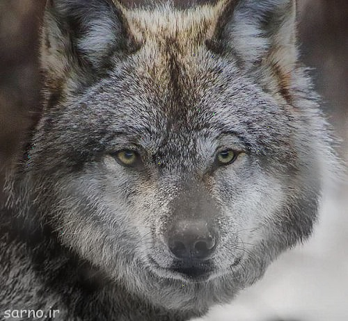
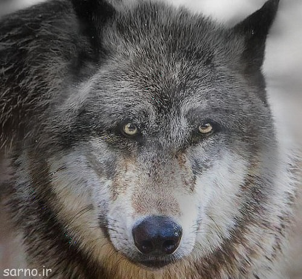

# Pyramid-Blending-and-Feathering
Compositing is the process of copying or inserting a part of one image into another image. Good compositing is hard for many reasons: because the image content must match in perspective, lighting, and in scene sense; because we must handle pixels at the edge of an image part which integrate light from the unwanted and wanted parts (e.g., the background and foreground); and because some objects are translucent or transparent and show the background.

# Images, group 1

  
  

# Results, group 1

  

# Images, group 2

  
  

# Results, group 2

  

# Images, group 3

  
  

# Results, group 3

  

# Images, group 4

  
  

# Results, group 4

  

